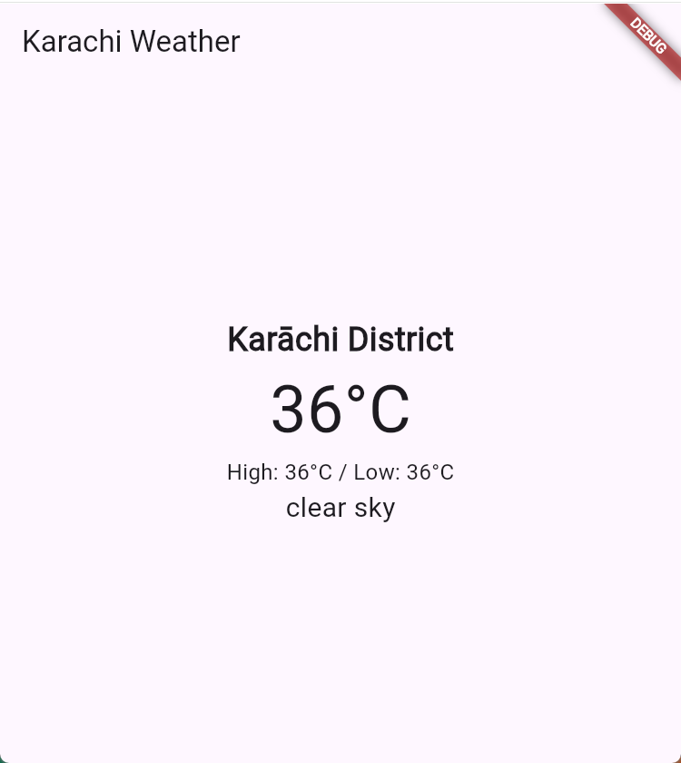

# Week4-assignment - Weather App - Group No. 4

## Group Members
- **Hamad Naseem** - 2280143  
- **Muhammad Bin Tariq** - 2280150

## About
A simple Flutter application that fetches and displays the current weather information for Karachi using the OpenWeatherMap API.

## Features

- Current Temperature
- High/Low Temperatures
- Weather Description
- City Name

### Prerequisites

- Flutter SDK
- OpenWeatherMap API Key

## Setup

  1. Clone this repository
  2. Run `flutter pub get` to install dependencies
  3. Set up your `.env` file with your OpenWeatherMap API key
  4. Run the app using `flutter run`

  

A few resources to get you started if this is your first Flutter project:

- [Lab: Write your first Flutter app](https://docs.flutter.dev/get-started/codelab)
- [Cookbook: Useful Flutter samples](https://docs.flutter.dev/cookbook)

For help getting started with Flutter development, view the
[online documentation](https://docs.flutter.dev/), which offers tutorials,
samples, guidance on mobile development, and a full API reference.
